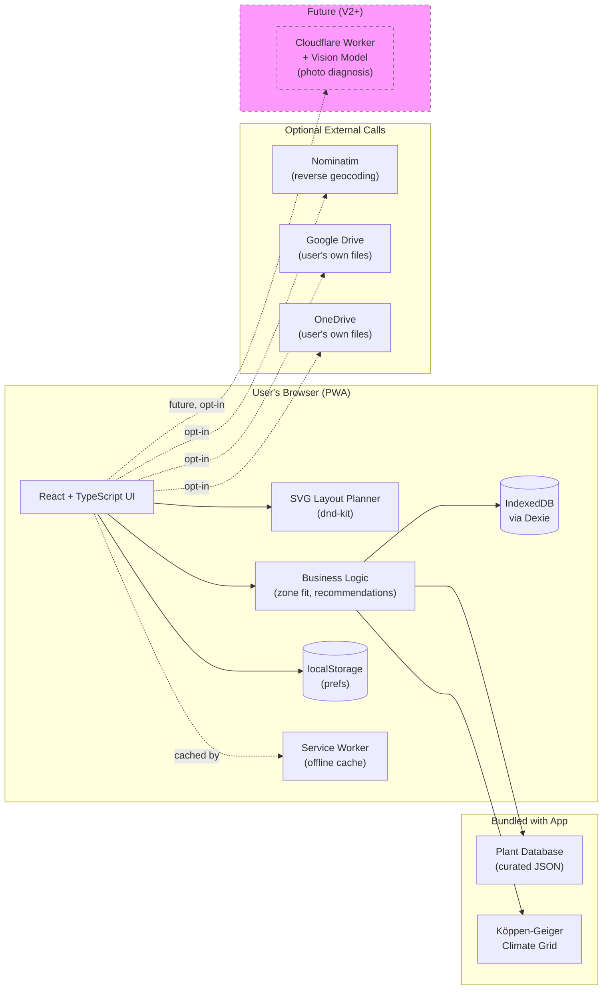

# Architecture

How peabrain is built, hosted, and pieced together.

## High-level shape

Peabrain is a **client-side Progressive Web App (PWA)**. Everything that
makes the product work — UI, garden data, planning logic, climate-zone
lookup, plant database, layout rendering — runs in the user's browser.
There is no peabrain-operated backend server.

Garden plans live in the user's browser via IndexedDB. They can be
exported as JSON (round-trippable) and as visual artifacts (SVG / PNG /
HTML). Optional cloud-storage integrations let the user sync plans to
their own Google Drive or OneDrive — peabrain itself never sees those
files.

This shape is deliberate: it eliminates entire categories of risk and
cost (no database to operate, no user accounts to manage, no auth tokens
to leak, no GDPR-implicating data store, no ongoing server bill). The
tradeoff is that anything genuinely needing a server — like sending a
photo to a vision model for plant diagnosis — has to be added later as a
narrow, well-scoped exception, not as a baseline assumption.

## Tech stack

| Layer | Choice | Why |
|-------|--------|-----|
| Language | **TypeScript** | Peabrain's domain model is rich and growing; TypeScript catches whole classes of bugs at compile time. Non-negotiable for this project. |
| UI framework | **React** | Largest ecosystem, mature accessibility/SVG libraries, and — critically — by far the best LLM-assisted code quality due to training-data abundance. We're building this LLM-assisted; that quality difference compounds. |
| Build tool | **Vite** | Fast dev server, well-documented, first-class TypeScript support, good PWA plugin (`vite-plugin-pwa`). |
| Package manager | **pnpm** | Disk-efficient and fast. (Open to npm if there's a reason to prefer it.) |
| Linter / formatter | **ESLint + Prettier** | Standard. Configure for a11y rules (`eslint-plugin-jsx-a11y`). |
| Testing | TBD — see [TESTING.md](./TESTING.md) | Likely Vitest + Playwright. |

## Hosting & deployment

**GitHub Pages**, served from the project's GitHub repo under the
Empathetech organization. Custom domain + SSL come for free.

Deployment flow: a GitHub Action builds the site on push to `main` and
publishes to the `gh-pages` branch (or via the `actions/deploy-pages`
workflow). Pull requests get a preview by manual `npm run build && npm run preview`
locally for now; we can add PR previews later if useful.

This is a not-a-one-way-door decision: if we ever need server-side
functionality (e.g., photo diagnosis), migrating to Cloudflare Pages or
Netlify takes about half a day and keeps the same domain. We'd switch
the moment we genuinely need edge functions, not before.

## Client-side storage

| Layer | Tech | Purpose |
|-------|------|---------|
| Structured app data | **IndexedDB via [Dexie.js](https://dexie.org/)** (MIT) | Gardens, surfaces, plantings, plant database cache, climate data cache |
| Tiny preferences | **localStorage** | Unit system (metric/imperial), theme, last-used location, UI flags |
| Exports | Browser download (`<a download>` or `showSaveFilePicker` where supported) | Save JSON / SVG / PNG / HTML to disk |

Why Dexie: IndexedDB's native API is awkward (event-driven, transaction-heavy).
Dexie wraps it with a clean Promise-based API, supports versioned schema
migrations, and is the de-facto standard for browser-side databases.

The plant DB and climate data are *cached* in IndexedDB after first load,
not authoritative — the bundled JSON shipped with the app is the source
of truth. This means an app update can refresh the dataset without
losing the user's gardens.

## Layout planner rendering

**SVG, hand-rolled with React.** The on-screen layout *is* the SVG export —
no second renderer to maintain. Native screen-reader support via semantic
elements + ARIA labels per shape. Pan/zoom built on top.

Supporting libraries:

- **[dnd-kit](https://dndkit.com/)** (MIT) — drag-and-drop for placing
  plants and surfaces. Strong keyboard-accessibility story, which matches
  our accessibility stance.
- Pan/zoom: hand-rolled to start (it's ~30 lines of mouse/touch handling).
  We can swap in `react-svg-pan-zoom` later if hand-rolled becomes
  insufficient.

We rejected Canvas because it has zero accessibility, would require us
to build a parallel screen-reader tree, and would force us to re-render
everything for SVG export. Performance is not a real concern at the
scale of a backyard (dozens to a few hundred shapes).

## External data sources

### Climate zones

**Bundled Köppen-Geiger dataset**, low-resolution global grid (~1°),
loaded lazily on first lookup. Source: Beck et al. high-resolution
Köppen-Geiger maps (CC BY 4.0). Stored in `public/data/koppen/` as
compressed JSON, fetched on demand, cached in IndexedDB after first load.

This works offline after first load, requires no API key, has no
per-request cost, and is precise enough for "what grows here" decisions.
Boundary cases (user is right on a zone edge) are surfaced honestly in
the UI — peabrain shows the zone with a small "near zone X border"
disclosure when applicable.

### Frost dates

**Bundled frost-date grid** alongside the Köppen data, queried by
lat/lon. Köppen alone is too coarse for accurate planting calendars —
a single zone (Cfb) covers London, Vancouver, and parts of New Zealand
with very different frost windows. The frost grid stores average last
spring frost and first fall frost dates per cell, with a year-to-year
variance estimate so the UI can surface confidence honestly ("approx
± 14 days").

Source: an open meteorological dataset (e.g., GHCN-derived isotherms),
chosen at build time and credited in `public/data/frost/attributions.md`.
Same bundled-once, cached-forever model as the Köppen grid.

Tropical zones legitimately have no frost — the dataset returns null
for those, and peabrain falls back to season-tag-based seasonality for
plants in those locations.

### Geocoding

Default path: **user types their city + country**, no third-party call,
maximal privacy.

Optional path: a one-tap "use my location" button that calls the browser's
`navigator.geolocation` API, then reverse-geocodes via **Nominatim**
(OpenStreetMap's free service). Result is shown for confirmation before
being saved. Per Nominatim's fair-use policy: rate-limited, identified
via a custom `User-Agent`, never called in tight loops. We will *not*
self-host Nominatim — usage volume will not approach their threshold.

Alternative providers (MapTiler, MapBox) are pluggable via a small
adapter interface in case Nominatim's fair-use policy tightens.

### Plant database

**Curated JSON in the repo,** authored from authoritative sources (RHS,
USDA, regional agricultural extensions). Starts with ~50–100 common food
plants. Schema includes: scientific + common names, Köppen zone fit
tiers (great/decent/stretch/impossible), surface fit (in-ground / raised
bed / planter / trellis), sun needs, days-to-maturity, companion
relationships, broad legal/invasive flags by region.

Versioned in `public/data/plants/` with an `attributions.md` file
listing every source used for every plant. Loaded lazily and cached in
IndexedDB. App updates can refresh the dataset without disturbing user
gardens.

The schema lives in [DATA_MODEL.md](./DATA_MODEL.md) once we write that doc.

## Cloud storage integrations

User-controlled file sync to the user's *own* cloud storage. Peabrain
itself never touches the bytes — we hand the file to the user's chosen
cloud's web SDK, the SDK uploads it to their account, peabrain forgets
about it.

| Provider | Web SDK | Status |
|----------|---------|--------|
| **Google Drive** | Drive Picker + Drive API v3 (OAuth2) | Planned for V1 |
| **OneDrive** | Microsoft Graph + File Picker | Planned for V1 |
| **iCloud Drive** | *No public web SDK for arbitrary user files.* CloudKit JS only supports app-specific containers, not the user's general iCloud Drive | **Not feasible.** iCloud users can use the export-to-file path and place the file in iCloud Drive themselves via their OS. |

Recommendation: **start with Google Drive only** for the first cloud
integration, prove the pattern, then add OneDrive. iCloud is documented
as "use OS-level export" since the web platform doesn't allow proper
integration. Update PRODUCT_OVERVIEW if this changes.

OAuth tokens live in `localStorage` *only for the duration of the
browser session*; we ask for the minimum scope (file-level, not
drive-level) and we use Google's "drive.file" scope which only grants
access to files peabrain itself created.

## Offline strategy

Peabrain should work fully offline once the app shell and data assets
are cached. The service worker is configured via **`vite-plugin-pwa`**
(which uses Workbox under the hood) with these caching policies:

| Asset class | Strategy |
|-------------|----------|
| App shell (HTML/JS/CSS) | `precache` on install — always available offline |
| Plant database, Köppen data | `stale-while-revalidate` — works offline after first load |
| Nominatim geocoding | `network-only` — geolocation features gracefully degrade when offline ("you're offline; type your location instead") |
| Cloud-storage uploads | Disabled while offline; user is told to retry when reconnected |

Garden data lives in IndexedDB which is inherently offline. The user
can plan, edit, and export their garden with no internet at all.

## Future server pathway

The MVP runs entirely in the browser. The first feature that *will*
require a server is **plant photo diagnosis** (V2+), which calls a
vision model. The server design for that future feature, when it comes:

- A single **Cloudflare Worker** (or similar serverless function) at a
  separate subdomain (e.g., `api.peabrain.example`)
- One endpoint: `POST /diagnose` accepting an image, returning a textual
  diagnosis
- No user data stored — the photo is forwarded to the model, the
  response returned, neither persisted
- Rate-limited per IP to control costs
- The frontend client treats this as an opt-in, per-photo action with
  clear "this sends your photo to a third-party AI service" UX

This is documented now so it doesn't surprise us later, and so the
client-side code is structured to make adding it straightforward
(an `if (capability.photoDiagnosis) { ... }` shape, gated on a build
flag or feature config).

## Architecture diagram

## Open questions

- **PR previews:** worth adding a Netlify-style preview-per-PR setup, or
  too much overhead for a small team? Defer until it hurts.
- **Bundle size budget:** what's the cap? A PWA that's 5 MB on first
  load is fine on broadband, painful on rural mobile. Capture as a
  budget once we have something to measure.
