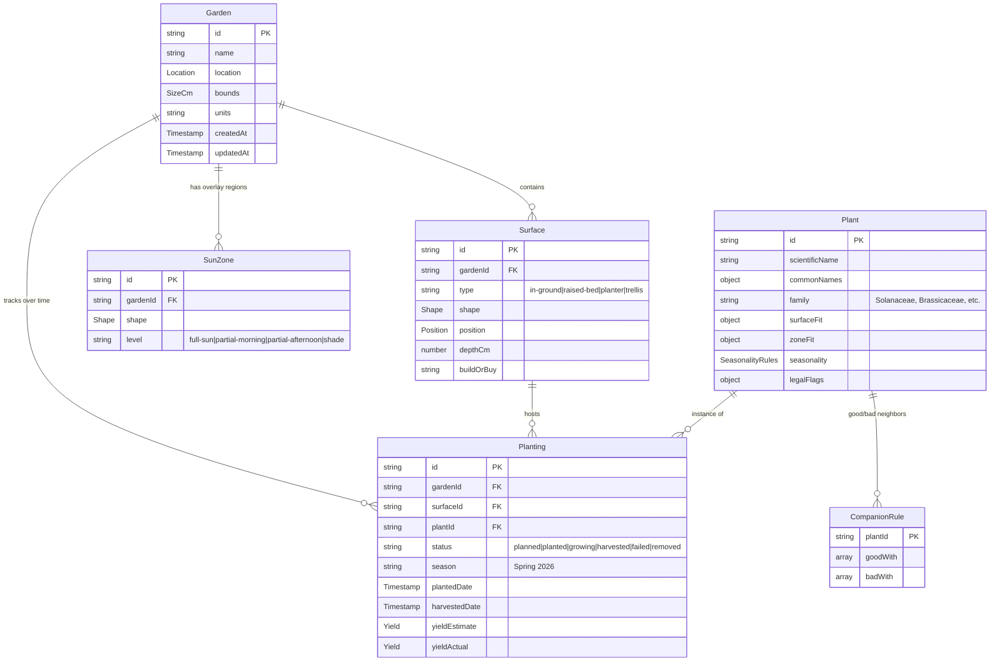

# Data Model

Peabrain's domain model — the entities, their relationships, how they're
stored, and how they evolve over time.

## Two tiers of data

Peabrain has two fundamentally different kinds of data, and they live in
different places:

| Tier | What it is | Where it lives | Lifecycle |
|------|------------|----------------|-----------|
| **Reference data** | Plant database, climate-zone grid, region info | Bundled with the app, cached in IndexedDB on first load | Versioned with app releases; refreshed on app update |
| **User data** | Gardens, surfaces, plantings, sun zones, preferences | Created in IndexedDB by the user | Owned by the user, exported as JSON, never sent anywhere |

This split matters: a user updating peabrain shouldn't lose their gardens,
and peabrain expanding its plant database shouldn't disturb anything the
user has already planted.

## Entity overview



## Reference data

Reference data is read-only from the user's perspective. It's bundled
with the app, fetched lazily, and cached in IndexedDB.

### Plant

The richest type in peabrain. One entry per plant we support.

```ts
type Plant = {
  id: string;                   // stable slug, e.g. "tomato-cherry"
  scientificName: string;       // "Solanum lycopersicum var. cerasiforme"
  commonNames: {                // localized; "en" required, others optional
    [locale: string]: string[]; // first entry is the canonical name in that locale
  };
  family: string;               // "Solanaceae" — used for crop rotation
  description?: string;         // short user-facing blurb
  imageUrl?: string;            // bundled image (see attributions.md)

  surfaceFit: {
    inGround: FitTier;
    raisedBed: FitTier;
    planter: { fit: FitTier; minVolumeL?: number };
    trellis: FitTier;
  };

  sunNeeds: "full" | "partial" | "shade" | "any";
  minSoilDepthCm: number;       // matters for surface fit (carrots want depth)
  spacingCm: number;            // plant-to-plant spacing
  wateringFrequency: "low" | "medium" | "high";

  // Fit per Köppen-Geiger zone (sparse — unspecified zones default to "stretch")
  zoneFit: {
    [koppenCode: string]: FitTier; // e.g. "Cfb": "great"
  };

  seasonality: SeasonalityRules;  // see below
  daysToMaturity: [number, number]; // [min, max], days from sowing to harvest

  yieldPerPlant?: {              // for budget/yield calculations
    amount: number;
    unit: "kg" | "g" | "count" | "bunch";
  };
  estimatedSeedCost?: {          // very rough, for budget previews
    amount: number;
    currency: "USD" | "EUR" | "GBP";
    perUnit: "seed" | "packet" | "seedling";
  };

  // Region-specific legal/regulatory flags
  // Keys are ISO 3166-1 alpha-2 country codes, optionally with subdivision
  // (e.g., "US-CA"). Values describe restriction tier.
  legalFlags?: {
    [regionCode: string]: {
      status: "illegal" | "permit-required" | "invasive";
      note: string;             // user-visible explanation
      reference?: string;       // URL to authoritative source
      asOf: string;             // YYYY-MM-DD — when we last verified
    };
  };

  sources: string[];            // attribution sources for this entry
};

type FitTier = "great" | "decent" | "stretch" | "impossible";
```

### SeasonalityRules

The hemisphere problem: planting calendars flip between northern and
southern hemispheres. We solve this by expressing seasonality
**relative to the user's local frost dates** rather than absolute
months. Frost dates already encode both hemisphere and climate-zone
variance, so the same plant data works globally.

```ts
type SeasonalityRules = {
  // Each window is expressed in weeks relative to the user's last
  // spring frost (negative = before, positive = after).
  // Example for tomatoes: startIndoors: [-8, -6], transplant: [2, 4].
  startIndoors?:  WeekRange;    // start seedlings indoors
  directSow?:     WeekRange;    // sow directly in soil
  transplant?:    WeekRange;    // move seedlings outdoors
  harvestWindow?: WeekRange;    // expected harvest window

  // Coarse-grained tag for plants without precise frost-relative data.
  // Used as a fallback for early MVP entries.
  seasons?: ("cool" | "warm" | "hot" | "year-round")[];

  // For perennials and tropical year-round plants, rules above don't apply.
  perennial?: boolean;
};

type WeekRange = [number, number]; // [min, max] weeks relative to last frost
```

When peabrain doesn't know the user's frost dates precisely, it falls
back to the Köppen zone's typical frost dates (bundled with the climate
data) and surfaces "approximate, set your local frost dates for better
accuracy" in the UI.

### Climate zone (Köppen-Geiger)

```ts
type KoppenCell = {
  // The bundled grid is keyed by quantized lat/lon
  latBucket: number;  // e.g., rounded to 1° resolution
  lonBucket: number;
  code: KoppenCode;   // "Cfb", "BWh", etc.
};

type KoppenCode = string; // 2-3 char Köppen-Geiger code

type ZoneInfo = {
  code: KoppenCode;
  description: string;                            // "Temperate oceanic"
  hemisphere: "northern" | "southern" | "either"; // computed per cell
};
```

Lat/lon → KoppenCell is a bundled lookup; KoppenCell.code → ZoneInfo is
a separate small table.

### Frost dates

Köppen zones are too coarse for accurate planting recommendations — a
single zone (e.g., Cfb) covers London, Vancouver, and parts of New
Zealand, with very different frost dates. We bundle a **separate
frost-date grid**, queried by lat/lon, derived from open meteorological
data (e.g., GHCN-derived isotherm datasets, all CC-licensed). Source
documented in `public/data/frost/attributions.md`.

```ts
type FrostDateCell = {
  latBucket: number;
  lonBucket: number;
  // "MM-DD" — averaged over recent decades
  avgLastSpringFrost?: string;   // empty string / undefined for tropical zones
  avgFirstFallFrost?: string;
  // Confidence proxy: how variable the date is year-to-year, in days.
  // Lets the UI say "approx ± 14 days" when the user is in a high-variance area.
  stdDevDays?: number;
};
```

Resolution: probably 1° to start, refine later if storage budget allows.
Tropical / equatorial zones legitimately have no frost — peabrain
detects that and falls back to season-tag-based seasonality (see below).

Users can override the lookup with their own observed frost dates on
their Garden record. The lookup is the default; user input wins.

### Region

For legal/invasive flags lookups. Lightweight.

```ts
type Region = {
  code: string;        // "US", "US-CA", "GB", "AU-NSW"
  name: string;        // "California, USA"
  parent?: string;     // hierarchical ("US-CA".parent = "US")
};
```

## User data

Created and edited by the user, lives in IndexedDB, exportable as JSON.

### Garden

The top-level container. **A user may have multiple gardens** (e.g., a
backyard plot *and* a balcony container garden) — modeling it that way
from the start avoids painful migrations later.

```ts
type Garden = {
  id: string;                 // UUID
  name: string;               // user-chosen, e.g. "Backyard"
  location: Location;
  units: "metric" | "imperial"; // overrides user pref for this garden
  bounds: { widthCm: number; heightCm: number }; // overall plot dimensions
  notes?: string;
  createdAt: string;          // ISO timestamp
  updatedAt: string;
};

type Location = {
  label: string;                                // "Lisbon, Portugal"
  countryCode?: string;                         // "PT"
  regionCode?: string;                          // "PT-11"
  // Coordinates are optional and only stored if the user opted in.
  // We round to 0.1° (~11 km) to avoid storing precise location.
  coords?: { lat: number; lon: number };
  koppenCode: string;                           // resolved at location-set time
  hemisphere: "northern" | "southern";
  // Optional user-overridden frost dates. If absent, fall back to zone defaults.
  lastFrostMonthDay?: string;                   // "03-15"
  firstFrostMonthDay?: string;                  // "11-10"
};
```

### Surface

A growing surface within a garden. Multiple surfaces per garden;
they can be in any combination of the four types.

```ts
type Surface = {
  id: string;
  gardenId: string;
  type: "in-ground" | "raised-bed" | "planter" | "trellis";
  name?: string;                              // "Bed A", "Tomato pot"
  position: { x: number; y: number };         // top-left corner, in garden cm
  shape: ShapeRect | ShapeCircle | ShapePolygon;
  depthCm?: number;                           // raised beds, planters

  // Acquisition lifecycle — how the surface comes to exist
  buildOrBuy?: "build" | "buy" | "existing";
  // Acquisition status, only meaningful when buildOrBuy != "existing"
  buildStatus?: "planned" | "in-progress" | "ready";
  estimatedCost?: { amount: number; currency: "USD" | "EUR" | "GBP" };

  notes?: string;

  // Trellis-only fields
  vertical?: {
    heightCm: number;
    orientationDeg?: number;  // 0 = facing north, 90 = east, etc.
  };
};

type ShapeRect    = { kind: "rect"; widthCm: number; heightCm: number };
type ShapeCircle  = { kind: "circle"; diameterCm: number };
type ShapePolygon = { kind: "polygon"; pointsCm: { x: number; y: number }[] };
```

Internal coordinate system: **centimeters everywhere**. We display in
the user's preferred units, but storage is unit-canonical to avoid
conversion bugs.

### SunZone

Overlay regions painted onto the garden indicating sun exposure. The
layout planner uses these to warn when a plant's sun needs don't match
the surface it's been placed in.

```ts
type SunZone = {
  id: string;
  gardenId: string;
  shape: ShapeRect | ShapeCircle | ShapePolygon;
  level: "full-sun" | "partial-morning" | "partial-afternoon" | "shade";
  notes?: string;
};
```

A given point in the garden may fall inside zero or more sun zones. If
multiple, the most restrictive level wins (full-sun beats partial-morning
beats shade, from the plant's perspective).

### Planting

A specific instance of a plant in a surface, tracked across its lifecycle.
The user owns the state — peabrain just shows them where they are and
nudges based on expected timing.

```ts
type Planting = {
  id: string;
  gardenId: string;
  surfaceId: string;
  plantId: string;                       // FK to Plant in reference data

  // Four-state lifecycle, set by the user. See below.
  status: "planned" | "growing" | "harvesting" | "done";
  // Set when status transitions to "done" — explains why it ended.
  endedReason?: "harvested" | "failed" | "removed";

  // Position within the surface (local coords, cm)
  positionInSurface?: { x: number; y: number };
  quantity: number;                      // how many of this plant

  // Dates — set as the planting progresses
  plannedDate?: string;                  // when added to the plan
  plantedDate?: string;                  // when actually in the ground
  endedDate?: string;                    // when status transitioned to "done"

  // Optional user-supplied label for grouping in the UI ("Spring 2026",
  // "Wet season 2026", "Year One"). Does not drive any calculations.
  // Crop rotation uses plantedDate + plant family, not this field.
  label?: string;

  notes?: string;
};
```

**Lifecycle:**

| Status | What it means |
|--------|---------------|
| `planned` | In the plan; not yet in the ground (surface may not exist yet either) |
| `growing` | In the ground; not yet producing |
| `harvesting` | Producing — go pick stuff |
| `done` | No longer producing; `endedReason` says why |

The user sets the status manually based on what they observe in the
yard. Peabrain helps by **computing an expected-harvest window** from
`plantedDate + plant.daysToMaturity` and surfacing nudges in the UI
when the user hasn't acted on a transition that's overdue
(e.g., "expected harvest window started 3 days ago — ready to mark
as harvesting?").

`endedReason: "harvested"` = a satisfying end. `failed` = didn't
survive. `removed` = pulled for non-failure reasons (made room for
something else, didn't like the variety, rotated out).

**On yield tracking:** peabrain is *not* trying to be a yield
spreadsheet. We deliberately don't track per-pick weights, harvest
events, or predicted-vs-actual deltas at the planting level. That's
data-entry tax with little payoff for a hobby gardener.

What peabrain *does* do with yield data is **planning-time
estimation** — see [BUSINESS_LOGIC.md](./BUSINESS_LOGIC.md). At
planning time, peabrain rolls up `plant.yieldPerPlant * quantity`
across all plantings to give a rough "expected harvest summary" for
the garden, alongside estimated build/material cost. This is for
deciding whether the project is worth it before committing — not for
post-hoc accounting.

If a user wants to capture how a planting actually went, they can use
the `notes` field. We don't model it as structured data.

### UserPreferences (localStorage, not IndexedDB)

```ts
type UserPreferences = {
  units: "metric" | "imperial";       // default for new gardens
  theme: "light" | "dark" | "system";
  defaultLocation?: Location;         // last-used or pinned location
  cloudStorage?: {
    provider: "google-drive" | "onedrive";
    enabled: boolean;
    // OAuth tokens live separately, session-scoped
  };
};
```

## Derived state — the fit-tier model

A plant's "fit" for a specific (location, season, surface, sun zone)
tuple is **computed**, not stored. This is the core of the recommendation
engine and is owned by [BUSINESS_LOGIC.md](./BUSINESS_LOGIC.md). Brief
sketch here so the data model is grounded:

```
fit(plant, location, season, surface, sunZone):
  zoneFit  = plant.zoneFit[location.koppenCode] ?? "stretch"
  surfFit  = plant.surfaceFit[surface.type] adjusted by surface.depthCm vs plant.minSoilDepthCm
  sunFit   = compatibility(plant.sunNeeds, sunZone.level)
  seasonFit = within plant.seasonality window for current date + frost dates?
  legalFit  = plant.legalFlags[location.regionCode]?.status

  → "impossible" if any single dimension is impossible OR legalFit is "illegal"/"invasive"
  → "stretch" if any dimension is stretch
  → "decent" if any dimension is decent
  → "great" only if all dimensions are great
```

Companion-planting and crop-rotation rules are layered on top as
*additional* warnings, not part of the base fit tier.

## Time, labels, and crop rotation

**Time-based logic uses dates, not labels.** The `Planting.label` field
(e.g., "Spring 2026", "Wet season 2026") is purely a user-chosen
grouping aid for the UI — peabrain shows "all plantings labeled X"
when the user wants. It is never read by recommendation, rotation, or
seasonality logic.

All real time-based logic uses **dates** (`plantedDate`, `endedDate`,
the user's frost dates, current date). This sidesteps the hemisphere
problem and the "what is spring in Singapore" problem in one move.

**Crop rotation** is a query against past plantings, keyed on date:

```
shouldWarnAboutRotation(surface, plantId, today):
  plant = lookup(plantId)
  recentPlantings = plantings.filter(p =>
    p.surfaceId == surface.id
    AND p.plantedDate is within last 2 years from today
  )
  return recentPlantings.any(p => lookup(p.plantId).family == plant.family)
```

This is why every Plant has a `family` field — botanical family is the
right granularity for rotation rules, not species. Tomatoes, peppers,
eggplants, and potatoes are all *Solanaceae* and shouldn't follow each
other in the same bed.

## Schema versioning

Dexie supports versioned schemas. We bump the schema version whenever
we change the *shape* of stored objects (adding optional fields doesn't
require a bump; renaming or restructuring does).

Migrations live alongside the schema definition (`src/db/schema.ts` or
similar) and run automatically on app load. We test migrations before
release by capturing snapshots of pre-migration data.

We never break old exports — the import path always handles every prior
schema version, even after we've migrated user data forward.

## How reference data updates flow into user gardens

This is a deliberate design choice worth knowing: **plantings reference
plants by `plantId`, never by snapshot.** The same is true for surface
fit rules, zone fit, legal flags, and yield estimates — all of those
live on the `Plant` record, not copied into `Planting`.

Consequences:

- When peabrain ships a new plant DB version (corrected spacing,
  updated legal flag, improved zone fit, new translation), every
  user's existing plantings *automatically* pick up the change next
  time they open the app. No manual migration, no per-garden update.
- The user's own choices — what they planted, when, how much, their
  yield — are completely untouched by reference-data updates.
- Frost-date updates work the same way: the `Garden.location` stores
  the *resolved* zone code at location-set time, but frost dates and
  zone fit are looked up live, so improvements propagate.

Things that *are* captured at user-decision time and don't update:

- The user's own observed frost dates (they entered them; they're theirs)
- Their predicted yield at planning time (`yieldEstimate`) — frozen for
  the predicted-vs-actual comparison
- Their notes, dates, and harvest records

This split is the right one for a tool that gets smarter over time
without overwriting the user's history.

## Import / export schema

Exports are self-describing JSON files with a versioned envelope:

```ts
type GardenExport = {
  $schema: "https://peabrain.example/schema/v1/garden-export.json";
  schemaVersion: 1;            // increments with breaking changes
  exportedAt: string;          // ISO timestamp
  appVersion: string;          // peabrain version that produced this file
  plantDbVersion: string;      // which plant DB version was in use

  garden: Garden;
  surfaces: Surface[];
  sunZones: SunZone[];
  plantings: Planting[];

  // Optional: snapshot of the plants referenced in this export, so a
  // future peabrain that no longer has these plant IDs can still
  // render the garden in read-only mode.
  referencedPlants?: Plant[];
};
```

Visual exports (SVG, PNG, HTML) are produced from the same in-memory
state by re-rendering the canvas. They are not round-trippable —
they're for sharing and printing. The JSON export is the round-trippable
canonical form.

## Storage layout (IndexedDB tables)

| Table | Tier | Key | Purpose |
|-------|------|-----|---------|
| `gardens` | user | `id` | One row per garden |
| `surfaces` | user | `id` (indexed by `gardenId`) | Surfaces in gardens |
| `sunZones` | user | `id` (indexed by `gardenId`) | Sun overlay regions |
| `plantings` | user | `id` (indexed by `gardenId`, `surfaceId`, `season`) | Planting events |
| `plants` | reference | `id` | Plant database cache |
| `koppenCells` | reference | `[latBucket, lonBucket]` | Lat/lon → zone lookup |
| `frostDateCells` | reference | `[latBucket, lonBucket]` | Lat/lon → frost dates |
| `zones` | reference | `code` | Köppen zone metadata |
| `regions` | reference | `code` | Region/jurisdiction metadata |
| `dataVersions` | system | `key` | Tracks plant DB / climate data versions for refresh |

## Open questions

- **Image storage.** Where do user-supplied notes-photos (V1+) live?
  IndexedDB can hold blobs, but we should set a per-garden cap.
  Defer until photo features are scoped.
- **Multi-device sync.** Cloud-storage integrations replace this for
  now (manually sync the JSON file via your own Drive). Real-time
  multi-device sync would require a backend — out of scope.
- **Plant database extensibility.** Should users be able to add their
  own custom plants not in our DB? My instinct: yes for V1+, with a
  clear "user-added" flag and the user owns the data. Defer.
- **Estimated cost currencies.** We support USD/EUR/GBP in the schema.
  Other currencies for global users? Likely yes — but FX is a rabbit
  hole. Defer to BUSINESS_LOGIC.md.
- **Multi-garden vs. single-garden UX.** The data model supports
  multiple gardens; the UI question of how to surface this is for
  USER_JOURNEYS.md.
