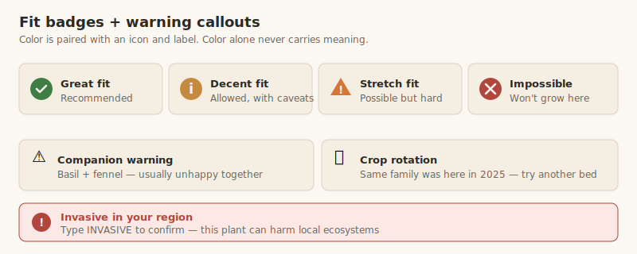
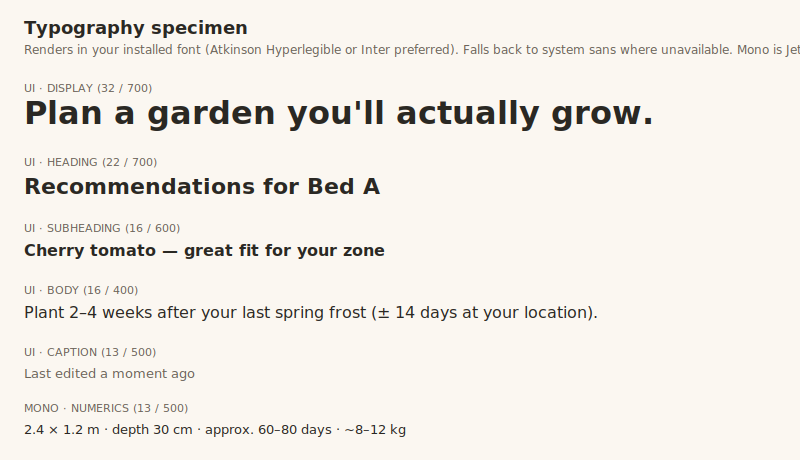
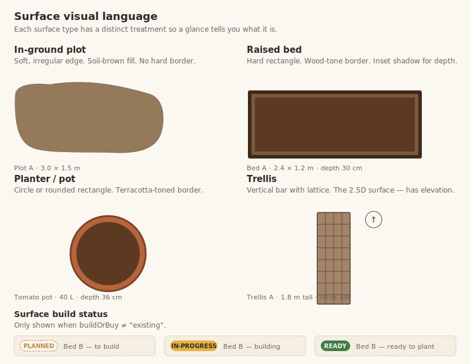
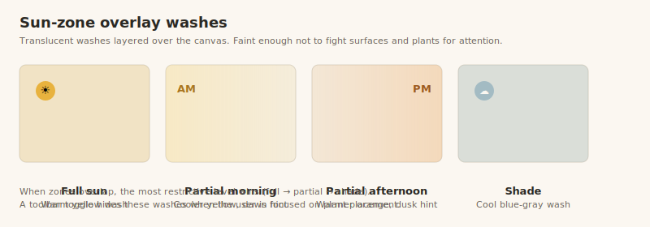

# Style Guide

Peabrain's visual language. Where [USER_JOURNEYS.md](./USER_JOURNEYS.md)
defines what users do, this doc defines what they *see and feel* doing
it. Detailed accessibility rules live in
[ACCESSIBILITY.md](./ACCESSIBILITY.md) and are cross-referenced here.

This is a design *direction*, not a final visual system. Specific hex
values, typography sizing tokens, and component-level Figma work get
locked in during build.

## Brand and tone

**Peabrain** is a humble, slightly self-deprecating name — and the
product should feel that way. We are not a clinical agronomy tool; we
are a kind gardening friend who happens to know things about climate
zones and crop rotation.

| Tone direction | Yes | No |
|---|---|---|
| Warm and human | "Looks like your peas should be ready around June 12 — give them a peek" | "Estimated harvest commencement: 2026-06-12" |
| Honest about uncertainty | "Approximately 60–80 days, give or take with weather" | "Maturity: 60 days" *(false precision)* |
| Encouraging, not patronizing | "Tomatoes can be tricky in your zone, but lots of folks do it well with shade cloth" | "Beginner-level plant; easy to grow!" |
| Playful where it fits | "🌱 Rooting around in your plant database…" | "Loading…" |
| Plain language | "This bed is a bit shallow for carrots — they like to dig deep" | "Soil depth insufficient for *Daucus carota* root system" |

The name is a permanent license to be a little goofy, but never at
the cost of clarity or respect for the user.

## Visual language

### Color palette

A garden palette that earns its colors — earthy and grounded, not the
clinical blue of generic SaaS apps. The hex values below are starting
points; iterate during build. Every pairing must meet WCAG AA contrast
against its intended background.

| Role | Hex | Notes |
|------|-----|-------|
| Garden green | `#3F7D44` | Primary actions, "great fit" |
| Terracotta | `#B8643A` | Planters, secondary actions, accents |
| Sun yellow | `#E8B23E` | Highlights, "ready to harvest" nudges |
| Sky blue-gray | `#7FA3B5` | Sky context, shade-zone indicators |
| Soil deep | `#5C3A21` | In-ground surface fills, raised-bed soil |
| Foliage soft | `#8FBA8C` | Plant icon variations |

**Status colors** (must meet WCAG AA contrast against both light and
dark mode backgrounds):

| Status | Hex |
|--------|-----|
| Great fit / success | `#3F7D44` |
| Decent fit / info | `#C68A3F` |
| Stretch fit / warning | `#D67635` |
| Impossible / blocked | `#B0463C` |
| Active harvest nudge | `#E8B23E` |

Color must **never** be the sole carrier of meaning — every status is
also conveyed by an icon, a label, or both. See ACCESSIBILITY.md.

### Fit badges and warning callouts

How fit tiers and warnings appear in the UI. Each badge pairs color
with an icon *and* a label so the meaning survives color-blindness,
black-and-white printing, and screen readers.

### Light and dark mode from day one

Gardeners use peabrain in bright outdoor sun *and* in dim sheds and
greenhouses at the end of the day. Dark mode is not a nice-to-have —
it's a real-use-case mode. Both modes meet WCAG AA contrast across
the entire UI.

We respect the user's OS preference by default and offer an explicit
toggle (light / dark / system) in settings.

### Typography

- **UI font:** a humanist sans-serif — likely **Atkinson Hyperlegible**
  (SIL OFL, accessibility-designed by the Braille Institute) or
  **Inter** (SIL OFL, broadly excellent). Final pick during build.
- **Mono font:** **JetBrains Mono** or **IBM Plex Mono** for small
  numerical readouts (dimensions, dates, days-to-maturity).
- **No display or handwriting fonts.** They conflict with localization
  and accessibility.
- **Type scale:** modular (e.g., 1.125 ratio); base body size 16 px
  minimum, tap targets 44 × 44 minimum.
- **Localization:** the type stack must support extended Latin,
  Cyrillic, Greek, CJK as a minimum. Numerals may need locale
  variants (Arabic-Indic, Devanagari) — confirm during build.

> Note: the SVG specimen renders in your system's installed font when
> Atkinson Hyperlegible / Inter aren't available. The live app will
> ship the actual webfonts.

### Iconography

Icons are used heavily — for surface types, plant categories, fit
tiers, status, warnings. Two non-negotiables:

- **Permissively licensed.** SIL OFL, MIT, Apache, or CC0. We never
  ship icons that require visible per-page attribution. Recommended
  starting set: **Lucide** (ISC) or **Phosphor** (MIT), both broad
  and tasteful.
- **Always paired with a text label or accessible name.** Icon-only
  buttons get an `aria-label`. Status icons announce their meaning
  to screen readers.

For plant icons specifically: stylized vector glyphs categorized by
plant type (leafy / fruiting / root / herb / vining / flower). We
don't try to draw a recognizable tomato — we show a "fruiting
vegetable" icon with the plant's name. Photographs are optional and
plant-specific (sourced under appropriate licenses; see LICENSING.md).

## Surface visual language

The layout planner needs to convey *at a glance* what kind of growing
surface each shape represents. This is one of the highest-leverage
visual decisions in the product.

| Surface | Visual treatment |
|---------|------------------|
| **In-ground plot** | Soft, irregular edge; soil-brown fill; no hard border. Suggests "carved out of the yard." |
| **Raised bed** | Hard rectangular outline (wood-tone border); fill in a distinct soil tone with a slight inset shadow to suggest depth. |
| **Planter / pot** | Circle or rounded-rectangle; terracotta-toned border; small icon indicating it's a container, not the ground. |
| **Trellis** | Linear element with a subtle lattice pattern; rendered as a vertical bar in the top-down view with an "elevation" hint icon (since trellises are the one inherently 2.5D surface). |

Each surface displays:
- A name label (user-set or auto-generated like "Bed A")
- Dimensions in the user's chosen units, in the mono font
- A small icon corresponding to its type, top-left
- Build status badge if `buildOrBuy != "existing"` and `buildStatus != "ready"`

Selected surface: thicker outline in primary green, plus a control
panel slides in from the right edge. Hover/focus: lighter outline.

## Plant visualization in surfaces

When plants are placed inside surfaces, they appear as small clustered
icons sized roughly to scale (so the user gets a *visual sense* of
spacing without us pretending to be a CAD tool).

- Icon glyph based on plant category, color tinted to suggest the
  plant's family
- Quantity shown as a small badge (e.g., "×6") rather than drawing 6
  individual icons unless the surface has space for it
- Status of the planting affects opacity / treatment:
  - `planned` — outline-only icon, dashed border
  - `growing` — filled icon, normal weight
  - `harvesting` — filled icon with a small accent highlight (sun yellow)
  - `done (harvested)` — desaturated, with a small check mark
  - `done (failed)` — desaturated, with a muted X
  - `done (removed)` — desaturated, no mark

Hover or focus on a plant cluster shows the plant card with all fit,
companion, and rotation info.

## Sun zone overlay

When the user has painted sun zones, the layout shows them as
**subtle translucent washes** over the canvas — present enough to
inform placement decisions, faint enough not to fight surfaces and
plants for attention.

| Sun level | Visual treatment |
|-----------|------------------|
| Full sun | Warm yellow wash |
| Partial morning | Cooler yellow gradient with a dawn-direction hint |
| Partial afternoon | Warmer orange gradient with a dusk-direction hint |
| Shade | Cool blue-gray wash |

There's a "sun overlay" toolbar toggle — on by default while mapping
or editing zones, off otherwise so it doesn't compete with plant
placement.

## Component vocabulary

A short list of named components peabrain uses repeatedly. Detailed
designs happen during build; the contract here is about *meaning*.

| Component | Purpose |
|-----------|---------|
| **Plant card** | Compact recommendation/result card showing name, family, fit tier, key constraints, and a "place" affordance |
| **Surface card** | Like plant card but for surfaces — shows type, dimensions, depth, sun coverage summary, plantings count |
| **Garden card** | Summary on the garden list — name, location, season summary, last-updated |
| **Fit badge** | Small visual indicator: great / decent / stretch / impossible. Always paired with an icon and label. |
| **Warning callout** | Inline annotation for companion conflicts, rotation warnings, sun mismatches. Color + icon + plain-language text. |
| **Empty state** | Friendly illustration + one-sentence explanation + one or two clear CTAs. Appears in: no gardens, no surfaces, no plantings, no sun zones |
| **Save indicator** | Persistent header element: "All changes saved" / "Saving…" / "Offline — saving locally" |
| **Toolbar palette** | Tool selector (add surface, paint sun, pan, zoom, undo, redo). Lives at the top of the layout planner. |

## Density and rhythm

- Comfortable, not dense. Hobbyist tool, not a power-user IDE.
- Generous touch targets (≥ 44 × 44 px) — many users will be on phones
  in the yard with dirty fingers.
- Vertical rhythm based on a 4 px grid; component padding scales in
  multiples.
- Respect user's OS-level reduced-motion preference; transitions are
  short and never block interaction.

## Layout patterns

- **Header:** logo, garden switcher, save indicator, settings menu.
- **Garden plan view:** layout canvas takes the majority of the screen;
  toolbar on top; collapsible side panel on the right for surface or
  planting detail.
- **Plant recommendations panel:** opens from the right when a surface
  is selected; closes when canvas is clicked.
- **Settings:** a single-page settings screen, not a modal. Sections
  for location, units, theme, frost dates, cloud sync, data export.

## Empty states (the friendly ones)

These appear often early in the user's journey and define a lot of
the product's feel:

| State | Content |
|-------|---------|
| No gardens yet | Illustrated welcome screen → "Start fresh" / "Import plan" |
| Garden with no surfaces | Calm illustration of an empty plot → "Drop in a raised bed, planter, or in-ground plot to get started" |
| Surface with no plantings | "This *raised bed* is empty. Want to see what'd grow well here?" → opens recommendations |
| No sun zones mapped | Subtle nudge in the garden header, not blocking |
| No frost dates set | Subtle nudge near seasonality info, with a "set them for better timing" link |

Empty states never blame the user or feel like an error.

## Motion and feedback

- **Save events:** the indicator briefly flashes "Saving…" then settles
  to "All changes saved." No toasts for routine saves.
- **Drag and drop:** the dragged element follows the pointer with a
  small lift shadow; valid drop zones gain a subtle glow.
- **Status transitions:** a soft confirmation animation when a
  planting moves states (e.g., growing → harvesting), no more than
  300 ms.
- **Errors:** toasts for things the user needs to know about (failed
  cloud sync, IndexedDB quota, import schema mismatch). Plain
  language, never stack traces.
- **Reduced motion:** when the OS reduced-motion preference is set, we
  swap animations for instant transitions. No exceptions.

## Open questions

- **Custom illustration vs. icon-set-only.** A small set of custom
  illustrations for empty states would lift the product's warmth
  significantly, but adds cost and licensing concerns. Defer to
  build-time decision once we see how empty states feel.
- **Light/dark logo treatment.** Will we have one peabrain wordmark or
  two variants? Defer to logo design.
- **Plant photography.** Photos for plant detail pages would help
  beginners ID plants in the wild. Sourcing under permissive licenses
  (Wikimedia Commons, plant-specific creative-commons collections)
  is feasible but tedious. Probably V1+, not MVP.
- **Print styles.** Exporting to HTML for printing is in the journey,
  but the print-specific style sheet (margins, page breaks, no
  toolbars) is a real design pass we haven't specified yet. Add when
  we get there.
