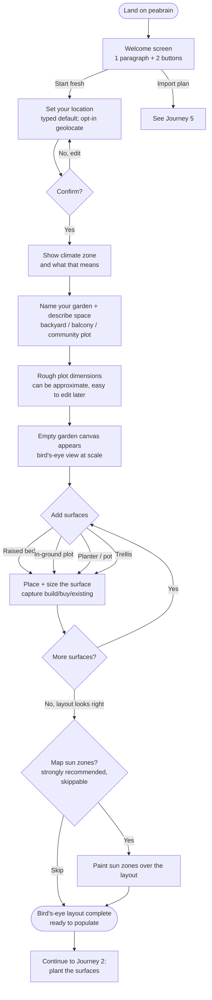
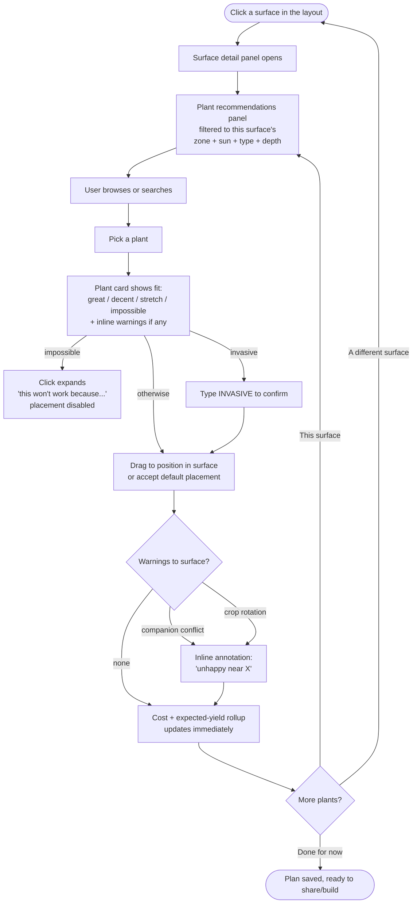

# User Journeys

The flows users walk through. Where [BUSINESS_LOGIC.md](./BUSINESS_LOGIC.md)
defines what peabrain *computes*, this doc defines what users *do* —
and in what order, with what choices, toward what outcomes.

## Principles

1. **No account; portability replaces persistence.** Onboarding must
   make it clear that data lives in this browser unless the user
   exports or syncs. Quiet failure to communicate this would be a
   trust break.
2. **Plan first, build later.** Peabrain's value is in deciding what
   to grow before spending money. The first session should reach a
   useful answer ("here's what fits your yard, here's the cost") in
   minutes, not hours.
3. **Bias toward defer-and-resume.** A gardener won't finish a plan in
   one sitting. Every screen should be safe to leave and return to —
   IndexedDB autosaves continuously.
4. **Explain before asking.** When peabrain asks for something
   privacy-adjacent (location, geolocation API, OAuth), explain
   *why* and what stays local before showing the prompt.

## Critical paths

These are the flows that define whether peabrain succeeds. We invest
the most design effort here.

### Journey 1 — First-time user lays out their space

**Goal:** From cold visit to a complete bird's-eye layout of the user's
garden — surfaces placed, sun mapped, ready to populate with plants —
in under 10 minutes. **Space first, plants second.** This mirrors how
real gardeners think: walk the yard, decide where the beds go, then
figure out what to grow.



**Decisions baked into this flow:**

- **Welcome screen is one paragraph and two buttons** ("Start fresh" /
  "Import plan"). No video, no tour, no email capture. The product
  itself is the tour.
- **Location is set before the canvas appears.** Without it, future
  plant recommendations would be noise. The typed-input default avoids
  any permission prompt for users who'd rather not share location.
- **The canvas appears empty and to-scale,** with the user's plot
  dimensions as the bounding box. They drop surfaces into the space
  rather than picking plants in the abstract.
- **Surface placement is the heart of Journey 1.** Build/buy/existing
  is captured per surface as it's added, so the cost rollup later is
  honest about what's already there vs. what needs purchasing.
- **Sun-zone mapping is offered after layout, not before.** Painting
  sun without seeing where the surfaces are doesn't make sense — but
  without sun zones, plant recommendations later default to "stretch"
  sun fit with a nudge to map sun.
- **No plants are picked yet.** This journey ends with a populated
  *space*, not a populated planting plan. Plant recommendations and
  placement happen in Journey 2.

**Time-to-value target:** under 10 minutes to a complete layout. The
"is this thing useful?" moment comes early in Journey 2 when peabrain
recommends specific plants tuned to the actual surfaces, sun, and
climate the user just described.

### Journey 2 — Populating surfaces with plants

After the layout is sketched, the user clicks a surface to plant it.
Recommendations are now grounded in the *specific* surface — its type,
depth, sun exposure, location — rather than generic to the user's region.



**Decisions baked in:**

- **Recommendations are surface-scoped, not garden-scoped.** When the
  user opens a raised bed, they see what fits *that bed* — its depth,
  its sun, the climate. Carrots rank higher in a deep bed than a
  shallow planter, automatically.
- **Plant cards always show fit *for the surface being populated.***
  The same plant looks different in different surfaces — a tomato is
  "great" in a deep raised bed and "decent" in a small planter — and
  the card reflects that live.
- **Warnings are layered, not stacked.** Fit-tier warnings, companion
  warnings, and rotation warnings appear in distinct visual zones
  (badge on the card, inline annotations on the layout, footer notice
  on the planting detail) so users can scan them without overload.
- **Save state is visible at all times.** "All changes saved" is the
  baseline; "saving..." briefly during writes.
- **The cost+yield rollup is visible from the first plant placed.**
  Cost-benefit framing is peabrain's main differentiator — show it
  early so the gardener can decide whether to keep going.

### Journey 3 — Returning user mid-season

User comes back weeks or months after planning to update reality.

```
Open peabrain → existing garden(s) load from IndexedDB
    ↓
Garden card shows summary:
  - 12 plantings: 3 planned, 6 growing, 2 harvesting, 1 done
  - "🍅 Tomatoes ready to pick around now (started ~14 days ago)"
  - "⏰ Sweet peas — expected harvest window started 3 days ago"
    ↓
Common return-visit actions:
  - Mark a planting from "planned" → "growing" (it's in the ground now)
  - Mark a planting from "growing" → "harvesting" (acting on the nudge)
  - Mark a planting "done" with reason: harvested / failed / removed
  - Add a quick note to a planting ("aphid trouble", "great variety",
    "harvested ~3 lbs over a week")
  - Add new plantings for the next season
```

**Decisions baked in:**

- **Status transitions are user-initiated, never automatic.** Even
  when the expected window has clearly passed, peabrain only nudges.
  The user sees the yard.
- **The dashboard surfaces "what needs attention now"** based on
  expected windows, but doesn't drown the user in nudges. One
  prominent suggestion + a collapsed "see all" works better than 14
  alerts.
- **Notes are the primary outcome capture.** Per the data-model
  decision, peabrain doesn't ask "how much did you harvest?" in
  structured form; it provides a free-text notes field on every
  entity.

### Journey 4 — Exporting a plan

Triggered when the user clicks "Export" from a garden's menu, or from
the global header.

```
Export menu →
  ┌─ Export as JSON (round-trippable backup) ──→ download .peabrain.json
  ├─ Export as SVG (sharable visual layout) ──→ download .svg
  ├─ Export as PNG (image for chat/print) ───→ download .png
  ├─ Export as HTML (printable + interactive) → download .html
  └─ Send to cloud storage [if configured]   ──→ Drive/OneDrive flow
```

**Decisions baked in:**

- **JSON is the canonical, round-trippable format.** Importing a JSON
  produces an identical garden. SVG/PNG/HTML are read-only for sharing.
- **All exports happen client-side.** The file never touches a peabrain
  server (because there isn't one).
- **Cloud-storage sync is "save as" first, "auto-sync" never.** The
  user explicitly chooses to push the current state to their Drive.
  We don't auto-overwrite their stored file silently.

### Journey 5 — Importing a plan

```
Welcome screen "Import plan" OR
Garden list "Import" button OR
Drag-and-drop a .peabrain.json onto the window
    ↓
Read file → validate schema version
    ↓
If schema is older: run migrations
    ↓
If a garden with the same ID already exists:
  Ask: replace, duplicate (with new ID), or cancel
    ↓
Garden(s) added to IndexedDB
    ↓
Show "Imported successfully — review your data" with a link to the garden
```

**Decisions baked in:**

- **Drag-and-drop works anywhere.** Lower friction than a hidden menu.
- **Schema migration on import is automatic and silent on success.**
  Migration failures show a clear error with "this file is from a
  newer peabrain — please update the app" or similar.
- **ID conflicts require user choice.** Never silently replace.

## Secondary flows

### Setting up cloud-storage sync

```
Settings → Cloud storage → Choose provider (Google Drive | OneDrive)
    ↓
Explain what we'll do: "We'll ask Drive for permission to read/write
files we create. We never see your other files. You can revoke
anytime in your Drive settings."
    ↓
OAuth popup (provider's, not peabrain's)
    ↓
User selects a folder for peabrain plans (or accepts default)
    ↓
"Sync now" enabled in the garden menu
```

iCloud is documented in [ARCHITECTURE.md](./ARCHITECTURE.md) as not
feasible — users on iOS export the file and place it in iCloud Drive
through the share sheet themselves.

### Managing multiple gardens

```
Garden list (top-level after onboarding) shows all gardens with:
  - Name, location, season summary, last-updated
  - + New Garden button

Selecting a garden enters its plan view.
Switching gardens is one click; no data loss.
Each garden has its own units preference (default from user prefs).
```

### Painting / editing sun zones

```
Garden plan view → "Sun zones" tool in the toolbar
    ↓
Toolbar palette of: Full sun / Partial morning / Partial afternoon / Shade
    ↓
User paints regions onto the garden canvas (rectangles or freeform)
    ↓
Existing surfaces auto-recompute fit based on new sun coverage
    ↓
Plantings whose sun fit changed get a small "fit changed — review" nudge
```

### Setting / correcting frost dates

```
Garden settings → Climate → Frost dates
    ↓
Show: lookup defaults (e.g., "Approx. last spring frost: April 15 ± 14 days")
    ↓
User can override with their own observed dates
    ↓
Override is per-garden, persists, and overrides the lookup for all
seasonality calculations on that garden
```

## Cross-cutting concerns

### Empty states

- **No gardens yet:** the welcome screen (Journey 1)
- **A garden with no surfaces:** prompt to add a starter surface, with
  a one-click "raised bed" or "ground plot" template
- **A surface with no plantings:** prompt to browse plant
  recommendations
- **No sun zones mapped:** subtle nudge on the garden header; plant
  cards default to "stretch" sun fit with explanation

### Failure modes

| Situation | Behavior |
|-----------|----------|
| User goes offline mid-session | App shell + bundled data still works; cloud-sync features grey out with "you're offline" tooltip |
| IndexedDB write fails (quota exceeded, browser policy) | Toast with explanation and "export your plan now to avoid losing data" |
| Browser data wiped (cookies cleared, incognito session ended) | All data lost — onboarding repeats. Mitigated by cloud sync and export education |
| Geolocation denied | Fall back to typed location seamlessly; no error |
| Plant DB version mismatch on import | Show "this file references plants we no longer have; rendering as read-only" with the missing-plant snapshot from the export envelope |

### Loading states

- App shell loads instantly from service-worker cache
- Plant DB and climate grid lazy-load on first use; show a one-line
  "loading reference data" indicator, not a blocking spinner
- IndexedDB reads on garden open are typically <50 ms; show no spinner
  for that

### Communication of data ownership

This deserves its own callout because it's a privacy promise we're
making throughout the product:

- **First-run welcome screen** says explicitly: "Your gardens live in
  this browser. Export them or sync to cloud to keep them safe."
- **Browser-storage warning** appears once when the user creates their
  first garden, with a "remind me to back up" toggle
- **Periodic gentle reminders** ("you haven't backed up in 30 days")
  for users without cloud sync configured

Quiet failure to communicate this would erode trust the moment a user
loses their data.

## Open questions

- **Mobile gestures.** The layout planner needs touch-friendly drag,
  pan, zoom on phones. Specific gestures (pinch-zoom, two-finger pan,
  long-press to delete?) are a STYLE_GUIDE/ACCESSIBILITY decision, not
  a journey decision — but worth noting that the journeys assume both
  desktop pointer and touch work.
- **Onboarding "tutorial mode."** Do we add an interactive walkthrough
  for first-time users beyond Journey 1? My instinct is no — the
  journey itself is short enough that a tutorial would feel
  patronizing. Revisit based on user feedback.
- **Garden templates.** Should we ship a few starter garden templates
  ("4×8 raised bed for a beginner", "Salsa garden", "Pollinator
  garden") that import as ready-made plans? Could be a great
  on-ramp; deferred to V1 unless we have time.
- **Bulk planting placement.** If the user wants 12 strawberries
  arrayed in a grid, do they place each one individually or use a
  "fill bed with N copies" tool? Ergonomic question; defer until we
  feel it in use.
